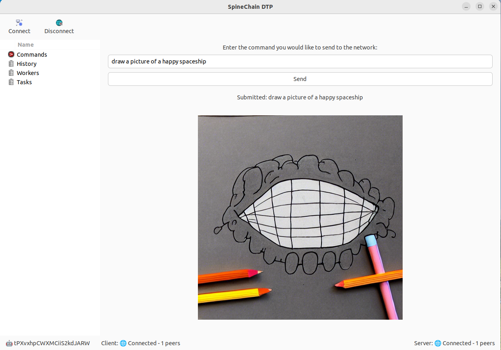

# dtp
SpineChain Distributed Task Platform

# What is the it?

The DTP is a tool for distributing tasks over a peer-to-peer network. It is written in golang.

# How to use it?

This is still in development, so the only way is to download the code and open it in visual studio using go run .

When you do that, you will see a ui. You need to run a second copy and then add the ip of the second copy in the default_peers.txt file.

# Installing on Ubuntu
- Install golang: https://go.dev/doc/install. Be sure to install the latest

- Install dependencies sudo apt install libgtk-3-dev libcairo2-dev libglib2.0-dev
- Clone the repository using git clone git@github.com:spinechain/dtp.git
- Install dependencies using go get spinedtp
- Run the software using go run . It will take a while to run the first time, be patient

# Development with VSCode
- Install go
- Install VSCode
- Install Go Extension for VSCode, and additional things like gopls, dlv

# Dependencies
You need gotk3 for the UI. You can get it here: https://github.com/gotk3/gotk3

# Author

Mark Essien
